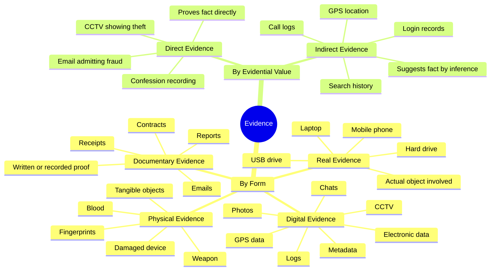
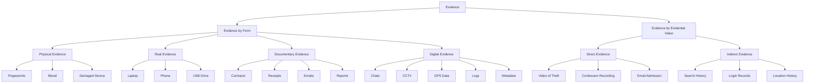

# Week 02 — Digital Evidence & Data Acquisition

---

## Part 1: Concept Map Activity — Types of Digital Evidence and Their Significance

In this activity, students create a concept map individually, in pairs, or in groups to show the relationships between different types of evidence and their significance in legal investigations. Evidence can be classified by its **form** and by its **evidential value**. In digital forensics, investigators usually combine multiple types of evidence to build a strong and reliable case.

---

## Types of Evidence by Form

### Physical Evidence

Physical evidence refers to **tangible items** that can be seen or touched.

**Examples:**
- Fingerprints
- Blood stains
- Weapon
- Damaged device
- Clothing

**Significance:**
It helps connect a person, place, or object to an incident.

---

### Real Evidence

Real evidence is the **actual object involved in the event**. It is often a type of physical evidence.

**Examples:**
- A stolen laptop
- A broken hard drive
- A mobile phone used in a crime
- A USB drive containing copied files

**Significance:**
It represents the original item directly linked to the case.

---

### Documentary Evidence

Documentary evidence includes **written or recorded documents** used as proof. It may exist in paper or electronic form.

**Examples:**
- Contracts
- Receipts
- Invoices
- Bank statements
- Emails
- Reports

**Significance:**
It helps prove communication, ownership, transactions, intent, or agreements.

---

### Digital Evidence

Digital evidence is any information stored, transmitted, or created in **digital form** that can be used in an investigation.

**Examples:**
- Emails
- WhatsApp chats
- SMS messages
- CCTV footage
- Photos and videos
- GPS history
- Browser history
- Metadata
- Login records
- File access logs

**Significance:**
This is the **most important category in digital forensics** because modern crimes often leave a digital trace. Digital evidence can reveal actions, timelines, identities, communication, and system activity.

---

## Types of Evidence by Evidential Value

### Direct Evidence

Direct evidence proves a fact **without needing much inference**.

**Examples:**
- CCTV showing a theft
- A confession recording
- An email admitting fraud
- A video showing unauthorised access

**Significance:**
It is highly valuable because it directly supports the fact being investigated.

---

### Indirect Evidence

Indirect evidence, also called **circumstantial evidence**, does not directly prove a fact but points to it through reasoning.

**Examples:**
- GPS data placing a suspect near the scene
- Browser history showing searches about hacking
- Login logs showing account access at a key time
- Call records showing repeated contact before an incident

**Significance:**
It helps investigators build the overall story of the case by connecting facts and patterns.

---

## Which Evidence Is Most Important in Digital Forensics?

In **digital forensics**, **digital evidence** is usually the most important because it directly relates to devices, systems, networks, and online activity. However, its value becomes even stronger when supported by other evidence such as:

- **Documentary evidence** — to show communication or records
- **Direct evidence** — to clearly prove an action
- **Indirect evidence** — to support a timeline or pattern
- **Real evidence** — such as the actual laptop or phone being examined

The most important category in digital forensics is **digital evidence**, but the **strongest investigations combine multiple evidence types together**.

---

## Simple Case Study

A company reports that confidential files were stolen from its office.

Investigators collect the following:

| Evidence Type | Item |
|---|---|
| Physical evidence | A damaged office door |
| Real evidence | The employee's laptop |
| Documentary evidence | An email warning about suspicious activity |
| Digital evidence | Login logs, CCTV footage, and file access records |
| Direct evidence | CCTV showing an employee entering the office at midnight |
| Indirect evidence | Browser history showing searches on how to copy files without detection |

**Conclusion:**
This case shows that different evidence types work together. The CCTV provides **direct evidence**, the logs and search history provide **indirect evidence**, the laptop is **real evidence**, and the email is **documentary evidence**. The **digital evidence** is especially important because it helps reconstruct what happened, when it happened, and who may have been involved.

---

## Mind Map



---

## Flowchart



---

## Summary

Evidence in legal and digital investigations can be organised by **form** and by **evidential value**. In digital forensics, **digital evidence is the most important type** because it captures electronic activity and system traces. However, the strongest legal cases are built by combining **digital, documentary, physical, real, direct, and indirect evidence** together.

---

## Fill in the Blanks — Activity

Classify each item as the most appropriate evidence type.

1. CCTV showing the student opening the cabinet = \_\_\_\_\_\_\_\_\_\_
2. USB drive containing the copied exam = \_\_\_\_\_\_\_\_\_\_
3. Printed exam paper on the desk = \_\_\_\_\_\_\_\_\_\_
4. System login record = \_\_\_\_\_\_\_\_\_\_
5. Email admitting access = \_\_\_\_\_\_\_\_\_\_
6. Fingerprints on cabinet = \_\_\_\_\_\_\_\_\_\_
7. Search history about password-protected files = \_\_\_\_\_\_\_\_\_\_
8. Laptop used to copy file = \_\_\_\_\_\_\_\_\_\_
9. Handwritten instruction note = \_\_\_\_\_\_\_\_\_\_
10. Phone location near office = \_\_\_\_\_\_\_\_\_\_

---

## Teacher Answer Key

| # | Item | Answer | Reason |
|---|---|---|---|
| 1 | CCTV shows student entering office | **Direct evidence** | It directly shows the action. |
| 2 | Actual USB drive containing the exam paper | **Real evidence** | It is the actual object involved. Also digital evidence, but real evidence is the best answer. |
| 3 | Printed copy of exam paper | **Documentary evidence** | It is a document used as proof. |
| 4 | System log shows account access | **Digital evidence** | Electronically stored system data. May also support indirect evidence. |
| 5 | Email saying "I got the exam paper" | **Direct evidence** | A direct admission. Also digital and documentary, but direct evidence is the strongest classification. |
| 6 | Fingerprints on filing cabinet | **Physical evidence** | A tangible trace collected from the scene. |
| 7 | Browser history about password-protected files | **Indirect evidence** | Suggests involvement but does not directly prove the theft. |
| 8 | Student's laptop used to copy the file | **Real evidence** | The actual object used in the incident. |
| 9 | Handwritten note saying "Print two copies before morning" | **Documentary evidence** | Written evidence. |
| 10 | Phone location data near the office | **Indirect evidence** | Places the student near the scene but does not directly show the act. |

---

---

## Part 2: Digital Data Acquisition Techniques

### What Digital Data Acquisition Means

Digital data acquisition is the process of collecting data from a digital device in a way that **preserves evidence**.

The main goals are:
- Collect the data completely and accurately
- Avoid altering the original evidence
- Preserve integrity for court or investigation
- Document every step taken

In digital forensics, acquisition is often the **first and most critical stage**, because poor acquisition can damage or invalidate later analysis.

---

## Main Types of Acquisition

### 1. Physical Acquisition

Physical acquisition means collecting a **bit-by-bit copy of the entire storage medium**.

This includes:
- Active files
- Deleted files
- Unallocated space
- Slack space
- File system metadata
- Hidden partitions
- Remnants of old data

**What it captures:**
- Current user files
- Deleted files not yet overwritten
- Partition tables and boot records
- File system structures
- Hidden and fragmented data

**Why it is useful:**
- Most complete form of acquisition
- Allows deleted file recovery, file carving, metadata analysis, and partition recovery
- Preferred in most forensic cases

**Limitations:**
- Slower and produces larger files
- Harder on encrypted or live systems
- More difficult in cloud/mobile environments

---

### 2. Logical Acquisition

Logical acquisition means **copying the files and folders visible through the operating system or file system**.

**What it captures:**
- Active visible files
- Folder hierarchy
- Some metadata
- System-visible content

**Usually not included:**
- Deleted files
- Unallocated space
- Slack space
- Raw partition artefacts

**Why it is useful:**
- Fast and practical when only certain files are needed
- Works on live systems, remote/cloud storage, and encrypted-but-unlocked devices

**Limitations:**
- Misses most low-level forensic evidence

---

### 3. File-System Acquisition

File-system acquisition **sits between logical and physical acquisition**. It collects file system structures plus files, without always capturing every raw disk sector.

**What it typically includes:**
- Files and folders
- File system metadata
- Directory entries and timestamps
- Allocation information
- Sometimes deleted entries still known to the file system

**Why it is useful:**
- Practical when physical imaging is not possible
- Captures more than logical acquisition
- Useful on modern storage that hides raw sectors

---

### Acquisition Level Comparison

| Level | What Is Captured | Best For |
|---|---|---|
| Physical | Entire raw disk, all sectors | Full forensic analysis, deleted file recovery |
| File-system | File system structures + metadata | More than logical; less than raw |
| Logical | Visible files and folders only | Speed, live systems, cloud |

---

## Imaging Methods

### Bit-Stream Imaging

Copies every readable bit or sector from the source device to an image file.

**Common formats:** RAW/DD, E01, AFF, AFF4

**Benefits:**
- Preserves full evidence
- Supports deleted file recovery
- Court-friendly when documented properly

---

### Disk-to-Image Acquisition

The source drive is copied into one or more forensic image files.

> Example: `laptop SSD → evidence.E01`

Common because image files are easier to store, hash, verify, and analyse.

---

### Disk-to-Disk Cloning

The source is copied directly to another physical disk.

> Example: `suspect drive → forensic target drive`

Useful for quick operational duplication, but image files are generally preferred in forensics.

---

### Sparse / Targeted Imaging

Only selected areas are collected — e.g., used sectors only, specific partitions, or user directories.

Useful when storage is very large, time is limited, or triage is needed.

---

### Live Imaging

Imaging while the system is **still powered on**.

Needed when:
- Encryption is active and unlocked
- Shutdown would cause data loss
- Volatile state matters
- Server downtime is not acceptable

> Risk: the system is changing while you collect from it.

---

## Imaging Formats

| Format | Pros | Cons |
|---|---|---|
| RAW / DD | Simple, widely supported, exact sector copy | No compression, no metadata container, large size |
| E01 | Compression, segmentation, metadata fields, checksums | Proprietary origins (though widely supported) |
| AFF / AFF4 | Metadata support, compression, extensible | Less universally supported |

---

## Common Forensic Tools

### Imaging & Acquisition
- FTK Imager
- EnCase Imager
- `dd` / `dcfldd` / `dc3dd`
- Guymager
- Magnet Acquire
- X-Ways Forensics
- Cellebrite UFED (mobile)
- Paladin boot environment

### Memory Acquisition
- DumpIt
- Magnet RAM Capture
- Belkasoft RAM Capturer
- WinPMEM
- LiME (Linux)

### Live Response / Triage
- KAPE
- Velociraptor
- F-Response
- CyLR
- Redline

### Analysis
- Autopsy / The Sleuth Kit
- EnCase
- X-Ways
- Magnet AXIOM
- Forensic Toolkit (FTK)
- Plaso
- Volatility (memory)
- Wireshark (network)

### File Carving
- PhotoRec
- Scalpel
- Foremost

---

## Forensic Imaging Workflow

```
Stage 1 — Preparation
  └─ Identify device, obtain legal authority, prepare tools, label evidence

Stage 2 — Preservation
  └─ Isolate device, use write blocker, document state

Stage 3 — Documentation
  └─ Photograph device, note screen state, record serial numbers

Stage 4 — Acquisition
  └─ Physical / logical / file-system / live capture
  └─ Memory capture if system is running

Stage 5 — Verification
  └─ Hash source and image (MD5 / SHA1 / SHA256)
  └─ Confirm hash match to prove integrity

Stage 6 — Storage
  └─ Secure evidence, maintain chain of custody

Stage 7 — Analysis
  └─ Parse artefacts, recover deleted data, build timeline
```

---

## Write Blockers

A **write blocker** is a hardware or software mechanism that allows reading from a device but **prevents any writes** to the source.

**Why it matters:**
Without write blocking, simply attaching a drive to a normal computer may alter last-accessed timestamps, system metadata, logs, and hidden system files.

| Type | Notes |
|---|---|
| Hardware write blocker | Physical device between evidence drive and examiner machine — most trusted |
| Software write blocker | Software-based protection — less trusted in court settings |

---

## Cloning vs Imaging

| | Cloning | Imaging |
|---|---|---|
| Result | A second physical drive | One or more forensic image files (`.E01`, `.dd`) |
| Used for | Operational duplication, working copies | Forensic preservation, case documentation |
| Verification | Harder | Easy — hash and compare |
| Storage | Requires another physical disk | Stored as files |

> In forensics, **imaging is generally preferred** because it is easier to preserve, hash, and document.

---

## Chain of Custody

**Chain of custody** is the documented history of how evidence was handled.

It answers:
- Who collected the evidence?
- When and where was it collected?
- Who has accessed it since?
- Has integrity been preserved throughout?

**Why it matters:**
If chain of custody is weak, the defence may argue that evidence was altered, tampered with, or is not from the original source.

**Typical chain-of-custody record includes:**
- Evidence ID and description
- Serial number
- Date/time seized
- Location seized
- Collector name
- Each person-to-person transfer
- Storage location
- Signatures or documented acknowledgement

> Think of it as the **legal tracking log** for evidence.

---

## Live Systems & Live Acquisition

### What Is a Live System?

A live system is a computer or device that is **still powered on and running** when examined.

### Why Live Acquisition Matters

Some evidence exists **only while the machine is running**:
- RAM contents
- Running processes
- Network connections
- Decrypted file systems
- Logged-in sessions
- Clipboard contents
- Encryption keys
- Unsaved documents

Powering off causes this **volatile evidence** to disappear permanently.

### Order of Volatility

Collect data in this approximate order (most volatile first):

1. CPU / cache / register-level info
2. RAM
3. Network connections
4. Running processes
5. System time
6. Logged-in sessions
7. Open files
8. Temporary files
9. Disks / persistent storage

### Risks of Live Acquisition

- Any interaction changes the system
- Commands executed leave traces
- Timestamps may change
- Malware may react
- Evidence can change during collection

> Live acquisition is powerful but must be **carefully documented**.

---

## Memory Acquisition

Capturing the contents of **RAM** can reveal:
- Encryption keys
- Passwords
- Chat fragments
- Malware payloads
- Injected code
- Command history
- Unsaved documents
- Process memory

**Tools:** WinPMEM, DumpIt, Magnet RAM Capture, Belkasoft RAM Capturer, LiME (Linux)

**Analysis tools:** Volatility, Rekall

---

## Static vs Live Forensics

| | Static Forensics | Live Forensics |
|---|---|---|
| When | After shutdown, from image | While system is running |
| Benefits | Controlled, repeatable, lower risk of altering evidence | Captures volatile data; essential for encrypted systems |
| Drawbacks | Loses volatile evidence | Changes the system; requires careful documentation |

---

## File-System-Based Recovery

Recovering data using **structures the file system already maintains**, such as:
- NTFS MFT (Master File Table)
- FAT table entries
- ext inode tables
- Directory entries
- Journals
- Allocation bitmaps

The forensic tool reads the file system's own records to find file names, deleted entries, timestamps, cluster locations, and permissions.

**Best when:**
- Metadata still exists
- Deleted entries are not fully overwritten
- File system is mostly intact

---

## Recovery Method Comparison

| Method | How It Works | Best When |
|---|---|---|
| Physical recovery | From raw disk image | Full analysis needed |
| File-system recovery | Uses file system structures and metadata | FS is mostly intact |
| File carving | Scans raw bytes for file signatures (e.g. `%PDF`, JPEG header) | No metadata remains |

> **File carving** ignores the file system entirely. Recovered files may lose their original name, folder path, and timestamps. Fragmented files may recover poorly.

---

## Encrypted Systems

Encryption changes the acquisition strategy significantly.

| Device State | Situation |
|---|---|
| Powered off | You may get only encrypted raw data — largely unusable without the key |
| Powered on and unlocked | Live acquisition can access decrypted volumes, memory-resident keys, and open files |

> This is a key reason why investigators sometimes **avoid immediate shutdown**.

---

## Advantages & Disadvantages Summary

| Method | Advantages | Disadvantages |
|---|---|---|
| Physical | Most complete; supports deleted data recovery; best for deep analysis | Slower; larger; sometimes impossible on modern or live systems |
| Logical | Fast; simple; practical for live and cloud systems | Misses deleted and raw artefacts |
| File-system | Richer than logical; often practical where physical is difficult | Not full raw disk coverage |
| Live | Captures volatile data; essential for encrypted systems | Alters the system; requires careful documentation |

---

## Real-Life Example

**Scenario:** Investigators seize a Windows laptop.

**If powered off:**
1. Remove SSD
2. Connect through hardware write blocker
3. Create E01 image using FTK Imager
4. Hash the drive (MD5 + SHA256)
5. Analyse MFT, deleted files, browser history, registry

**If powered on and logged in:**
1. Photograph the screen
2. Note time and system state
3. Capture RAM using WinPMEM
4. Collect running processes and network connections
5. Decide: live disk acquisition or controlled shutdown

> The decision depends on encryption status, volatility risk, legal scope, and incident-response urgency.

---

## The Key Forensic Principle

> **Preserve first. Analyse second.**

- Do not examine the original carelessly
- Acquire safely using write blockers
- Hash and verify the image
- Document every action thoroughly
- Work from copies whenever possible

---

## Final Summary

Digital acquisition techniques are used to collect evidence from devices in a **forensically sound** way. Physical acquisition captures the entire storage medium bit by bit, including deleted data and unallocated space. Logical acquisition captures only files and folders visible through the operating system. File-system acquisition captures the file system's structures and metadata, giving more detail than logical but less than full raw imaging.

Imaging creates forensic copies in formats such as RAW or E01, while cloning copies one disk directly to another. Chain of custody is the documentation proving who handled evidence and when. In live systems, investigators may collect RAM, running processes, and decrypted data without shutting down, but this must be done carefully because it changes the system.

The overall goal is always to **preserve integrity, collect relevant evidence, and support reliable analysis**.
